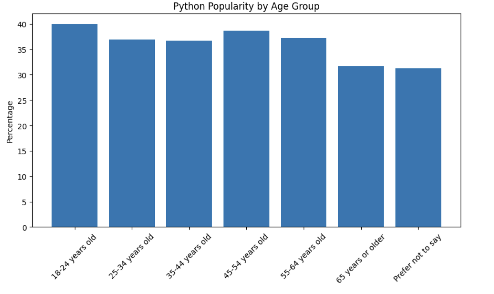
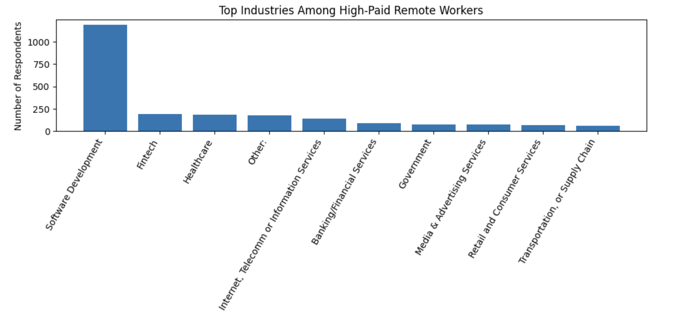

# Stack Overflow Developer Survey Analysis

## Open in Google Colab

[Open Notebook in Google Colab](https://colab.research.google.com/drive/1Zbntlt4vdbMHiYa4GfDGVbIWHJUFEyov)

## Overview

This project explores the Stack Overflow Developer Survey dataset using Python and Pandas.

The analysis focuses on:

- Python popularity
- Compensation analysis
- Remote work trends
- Learning methods
- Education analysis
- Industry analysis

## Tools Used

- Python
- Pandas
- Matplotlib
- Google Colab

## Key Findings

- 37.54% of respondents reported using Python.
- Online courses are among the most popular learning methods.
- Compensation varies significantly across countries.
- Remote work remains common among developers.
- High-paid remote workers are concentrated in specific industries.
  ## Sample Visualizations

### Python Popularity by Age Group

### Top Industries Among High-Paid Remote Workers

## Files

- `stack_overflow_survey_analysis.ipynb` — main analysis notebook
- `python_popularity_by_age.png` — sample visualization
- `top_industries_remote_workers.png` — sample visualization

## Author

Taisiia Petrovska
